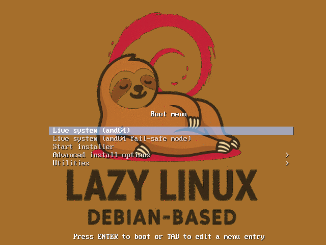
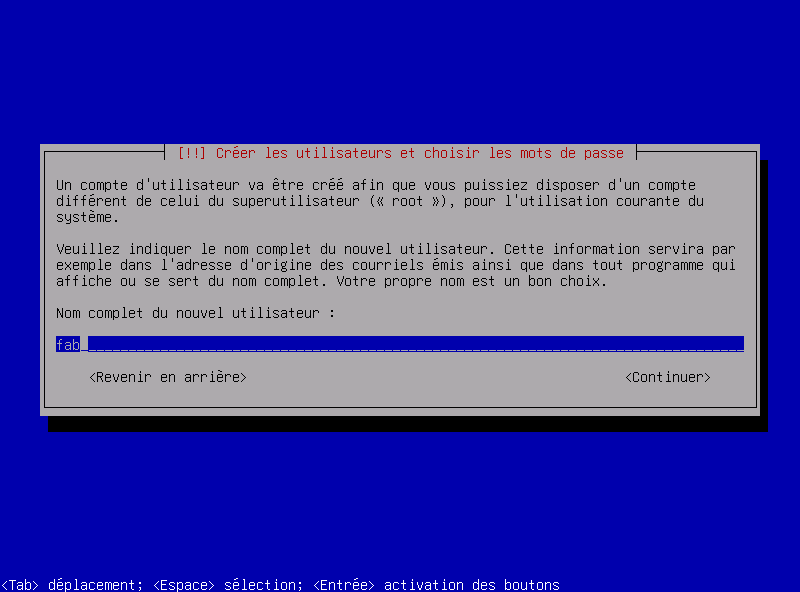
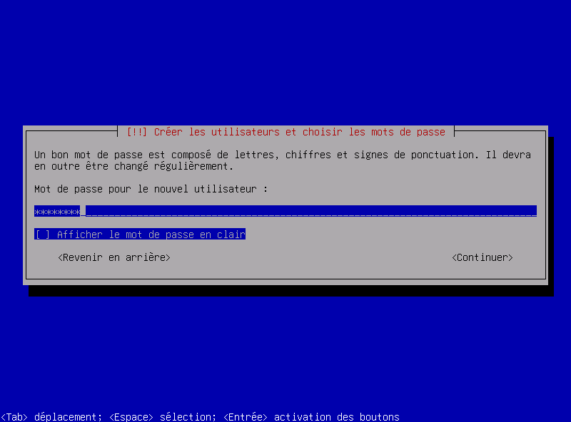
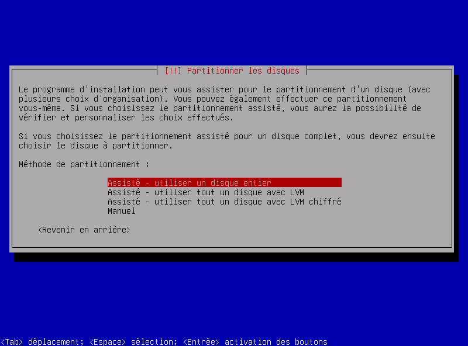
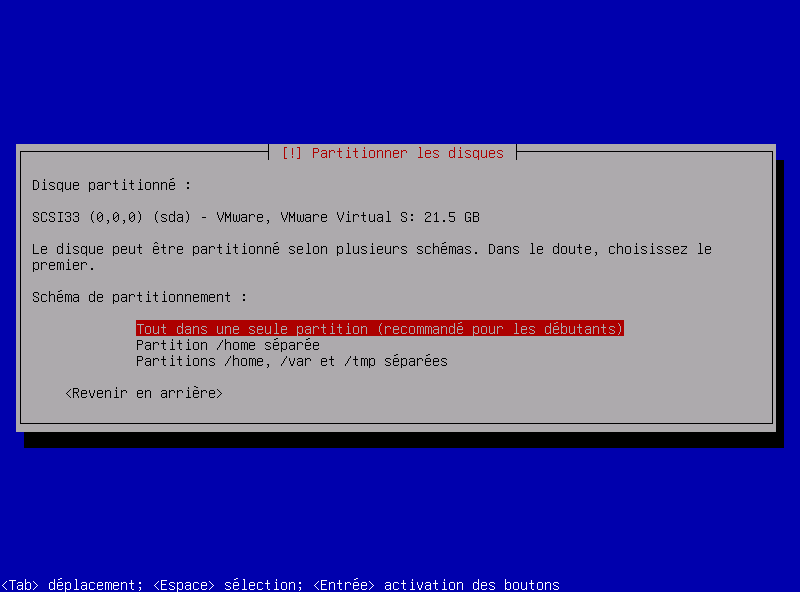
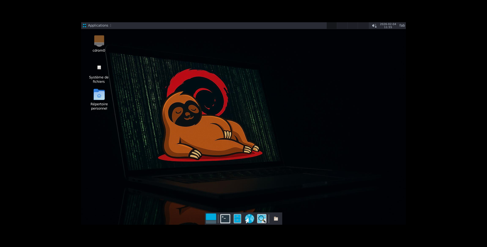

# 🐧 Lazy Linux


Distribution Debian 12 (Bookworm) personnalisée pour l'administration système et la sécurité réseau.

## 🎯 Caractéristiques

- **Interface moderne** : XFCE avec thème Arc-Dark et icônes Papirus
- **Terminal Zsh** : Oh My Zsh + Powerlevel10k préconfiguré
- **Sécurité renforcée** : UFW, Fail2ban, AppArmor, Lynis
- **Outils réseau** : Firefox ESR, Wireshark, nmap, tcpdump, iperf3, mtr
- **Monitoring** : Glances, htop, lm-sensors
- **Clavier FR** : Configuration française automatique
- **SSH sécurisé** : Port custom configurable + sshd_config auto-configuré

## 📸 Screenshots

### Boot Menu


### Installation - Set User


### Installation - Set Password


### Installation - Choix du mode de partitionnement


### Installation - Choix du Disque


### Bureau XFCE avec Arc-Dark



## 📦 Installation

Télécharge l'ISO et boot dessus. L'installateur Debian s'occupe du reste !

## 🔧 Build depuis les sources
```bash
# Prérequis
sudo apt update
sudo apt install -y live-build git debootstrap

# Cloner le repo
git clone https://github.com/g-fab/lazy-linux.git
cd lazy-linux

# Configuration
sudo lb config \\
  --distribution bookworm \\
  --archive-areas "main contrib non-free non-free-firmware" \\
  --debian-installer live \\
  --debian-installer-gui false \\
  --bootappend-live "boot=live components locales=fr_FR.UTF-8 keyboard-layouts=fr keyboard-variants=latin9" \\
  --bootappend-install "locale=fr_FR.UTF-8 keymap=fr keyboard-configuration/xkb-keymap=fr" \\
  --mirror-bootstrap http://deb.debian.org/debian/ \\
  --mirror-binary http://deb.debian.org/debian/ \\
  --apt-recommends false \\
  --system normal \\
  --iso-application "Lazy Linux" \\
  --iso-volume "LazyLinux-1.0" \\
  --image-name "lazy-linux"

# Build (30-40 min)
sudo lb build 2>&1 | tee ~/build.log
```

## 🚀 Commandes utiles

- `update` - Mise à jour système
- `ports` - Voir les ports ouverts
- `lazy-setup` - Configuration SSH/Firewall
- `lazy-audit` - Audit de sécurité Lynis

## 🚀 Lazy Aliases
- `c` = clear
- `..` = cd ..
- `...` = cd ../..
- `snano` = sudo nano -l
- `nano` = nano -l
- `lla` = ls -la

## 📚 Documentation

- [Guide de Build](docs/Build-Distro.md)
- [Guide de Customisation](docs/Customize-Distro.md)

## 📝 Licence

GPL-3.0

## 👨‍💻 Auteur

Fab
